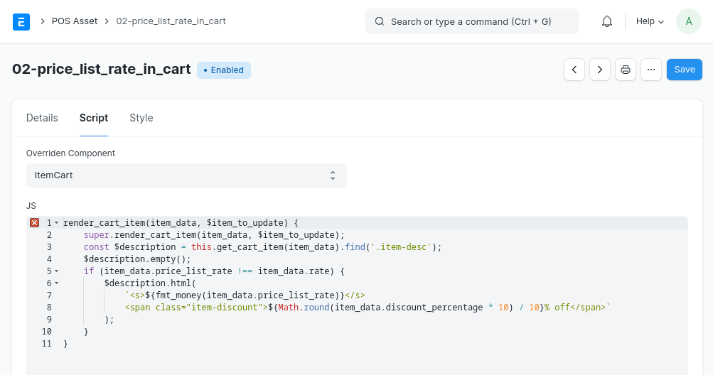

## POS X

ERPNext POS Extended

### Usage

`erpnext.PointOfSale` components can be extended by selecting the component and overriding its methods as shown in the screenshots. Styles can also be added in the _CSS_ field.

The example shown above renders the `price_list_rate` and the `discount_percentage` of an item in the **ItemCart** component.

### License

MIT
